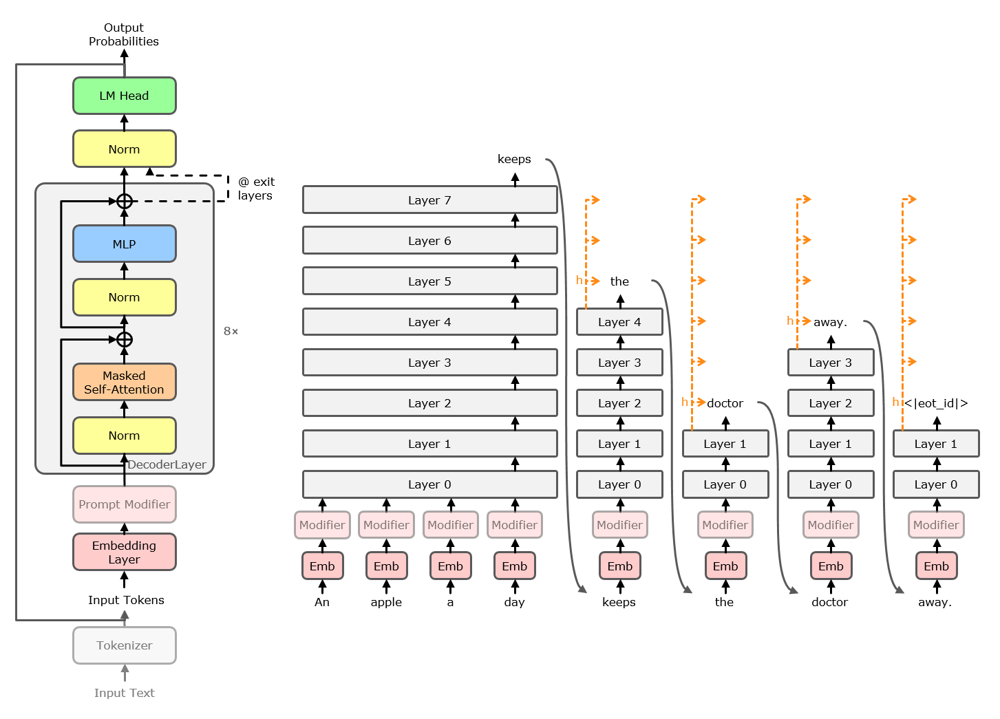

# Early-Exit-extended Llama and Early-Exit Facilitation Through Input-Sequence Adaptation

This repository extends the [transformers Llama model](https://github.com/huggingface/transformers/tree/v4.57-release/src/transformers/models/llama) to allow for fully-adaptive early-exit and provides means to modify the model inputs to facilitate earlier exits. 

Our implementation of a classic early-exit approach for Llama ("Llama 3 EELlama") is mainly based on the original [transformers Llama code](https://github.com/huggingface/transformers/tree/v4.57-release/src/transformers/models/llama), and the works on early-exit from [Elbayad et al. (2019)](https://openreview.net/forum?id=SJg7KhVKPH), [Schuster et al. (2022)](https://dl.acm.org/doi/10.5555/3600270.3601539), [Varshney et al. (2024)](https://aclanthology.org/2024.findings-naacl.232/) and [Jamialahmadi et al. (2025)](https://github.com/benyaminjami/Balcony-LLaMA/).

For inducing earlier exits through adaptation of the input-sequence, our code implements the following approaches:
* **Simple word-level adaptations** of dataset prompts (&#8594; visible effect).
* Tuning the attention weights of specific tokens in the attention mechanism, based on properties like part-of-speech or equality to specific words/symbols/special tokens (&#8594; in our experiments without success). 
* Fine-tuning of the model's embedding layer on early-exit by overfitting on single instances and bagging-style averaging over the overfitted embedding matrices (&#8594; small improvement achievable).
* Automatic input token adaptation by a trained **prompt modifier** (either a separate neural module, or the first decoder layer). This includes various **early-exit training recipes** (&#8594; significant improvements achievable).

The early-exit model is able to record statistics during its execution and we provide varios evaluation methods, most notably computation of the model perplexity and an LLM-as-a-judge assessment.

Built with Meta Llama 3.

Visualization of our classical fully-adaptive early-exit implementation. In each forward pass, the model exits at the first layer at which its softmax confidence (highest softmax value of all vocabulary tokens) is above a predefined threshold. The orange arrows indicate how hidden states are copied for key and value computation ("state copying"). Adapted from [Schuster et al. (2022)](https://dl.acm.org/doi/10.5555/3600270.3601539) and [Bae et al. (2023)](https://aclanthology.org/2023.emnlp-main.362/).

## Branches
This repository contains the following branches:

* **main**: Contains the main contributions of this repository, but not the complete code for all the approaches mentioned above. In particular, it contains the EELlama model implementation, the script for performing simple prompt adaptations on a dataset, utilities for tracking attention statistics, recipes for training the EELlama model and fine-tuning layer 0 as a prompt modifier (which includes the recipe for promoting earlier exits) and scripts for inference and evaluation with/of the model.
* **pure-EELlama**: Version of the code that contains only the bare EELlama model and scripts for training, inference and evaluation, but no attention weight analysis/tuning and no prompt adaptations.
* **attention-stats**: Version for analyzing attention weights computed for each input token and for tuning these weights for earlier exits.
* **EE-tuned-embedding**: Version for fine-tuning the model's embedding layer and for tuning of it for early-exit by overfitting on single instances.
* **prompt-modifier**: Version for training a separate prompt modifier module or fine-tuning the model's layer 0 for facilitating early-exit.

## Installation
You need Python for execution of our codebase (we used Python 3.10). Create a Python environment and follow these steps:
* Install the requirements from `requirements.txt`
    - A comprehensive snapshot is given in `requirements_comprehensive.txt`
* Create/copy an access token on huggingface
* Execute `huggingface-cli login` and paste the access token
* Download the example model files from <https://github.com/Hand5n/facilitated-early-exit-llama/releases/tag/v1.0> and extract them into the `models/` directory.
* To test the installation, adapt the `model_id`, `adapter_path` and further parameters in file `src/inference_fine_tuned.py` and execute it.
* Follow the steps of the following subsections as soon as required for your use case

### Model Evaluation with an LLM-as-a-Judge
To use the LLM-as-a-Judge method for model evaluation, you need to assign a judge model to [deepeval](https://deepeval.com/). For example:
* Create an API key on aistudio.google.com/
* Execute `deepeval set-gemini --model-name="gemini-2.5-flash-lite" --google-api-key="<API-KEY>"`
* Set parameters in `src/.deepeval/.deepeval`: 
    "GEMINI_MODEL_NAME": "gemini-2.5-flash-lite", 
    "GOOGLE_API_KEY": "&lt;API-KEY&gt;"

### POS-Tagging in `src/create_dataset.py` and on branch `attention-stats`
To perform part-of-speech tagging, you need to install the spacy library:
* `pip install -U spacy`
* `python -m spacy download en_core_web_lg`

## Datasets
All datasets used in our experiments are derived from the `cnn_dailymail` dataset from the `datasets` library. The Python files contain lines of code like the following to pick a subset:

    from datasets import load_dataset

    split="validation"
    first_index = 0
    num_items = 32

    dataset = load_dataset("cnn_dailymail", "3.0.0", split=split)
    # Reduce to only short instances of the dataset
    print("Filtering dataset")
    dataset = dataset.filter(lambda row: len(tokenizer.encode(row['article']+row['highlights']))<400)
    print("Whole dataset length:", len(dataset))

    dataset = dataset.shuffle(seed=42).select(range(first_index, first_index+num_items))

    dataset.to_json(f"../datasets/cnn-dm_validation_short-shuffled{first_index}-{first_index+num_items}.json")

These code blocks can be enabled setting CREATE_DATASET=True just before the block. For example, setting `split="validation"`, `first_index=32`, `num_items=20` will produce dataset `cnn-dm_validation_short-shuffled32-52.json`.

To generate datasets consisting of full-model outputs (postfix `_full_model_generations`), use the corresponding code blocks in `src/ee_tune_embedding.py` on branch `EE-tuned-embedding`/`prompt-modifier` and `src/create_dataset.py` (activate with `CREATE_TOKENIZED_DATAEST=True`).

## Usage

### Usage of the EELlama model:

Required imports:

    from transformers import AutoConfig, AutoTokenizer, AutoModelForCausalLM
    from transformers_override.models.llama.configuration_eellama import EeLlamaConfig
    from transformers_override.models.llama.modeling_eellama import EeLlamaForCausalLM
    from peft import PeftModel
    import torch

#### Basic instantiation of an EELlama model:

Configuration:

    model_id = "meta-llama/Meta-Llama-3-8B-Instruct"
    adapter_path = "../models/llama-3-eellama-3-8B-instruct/llama-3-eellama-3-8B-instruct-adapter-cnn-dm/checkpoint-4830"
    exit_layers=[7, 15, 23, 31]
    ee_softmax_threshold=[0.9, 0.9, 0.9, 0.9]   # correspond to the first exit layer up to the last exit layer
    output_full_model=False                     # Set to True for training, set to False for normal inference

Instantiation:

    model = EeLlamaForCausalLM.from_pretrained(
        model_id,
        torch_dtype=torch.bfloat16,
        device_map=0,

        exit_layers=exit_layers,
        ee_softmax_threshold=ee_softmax_threshold,
        output_full_model=output_full_model
    )

    tokenizer = AutoTokenizer.from_pretrained(adapter_path if adapter_path != None else model_id)
    
    if adapter_path != None:
        model = PeftModel.from_pretrained(model, adapter_path)

#### Basic inference invocation (here text generation, given a [CNN/DailyMail](https://huggingface.co/datasets/abisee/cnn_dailymail) article to summarize):
Configuration:

    user_input = "We had no idea how much we would really, really, really, really like Tom Hanks lip-syncing to a Carly Rae Jepsen song, but we really do. Hanks shows up in the new video for \"I Really Like You,\" \"singing\" Jepsen's part throughout. The Oscar-winning actor is apparently playing himself, signing autographs for fans, and generally being a very cheery movie star, before he and Jepsen take part in a flash mob. So what exactly is Tom Hanks doing in this video in the first place? Turns out he is good friends with Scooter Braun, manager for Jepsen (and Justin Bieber, who also appears in the video). He even sang and danced at Braun's wedding. ABC reported that Hanks suggested himself to play the role, after Jepsen said it would be amusing for a man to lip-sync her song. The result, as you can see, is kind of magical."
    do_sample = False
    use_cache = False

Input preparation:

    messages = [
        {"role": "user", "content": user_input},
    ]

    tokenizer_result = tokenizer.apply_chat_template(
        messages,
        add_generation_prompt=True,
        return_tensors="pt",
        return_dict=True
    ).to(model.device)

    input_ids = tokenizer_result["input_ids"]
    attention_mask = tokenizer_result["attention_mask"]

    model.eval()

    terminators = [
        tokenizer.eos_token_id,
        tokenizer.convert_tokens_to_ids("<|eot_id|>")
    ]

    eval_stats = ["exit_layer"]
    stats = {}

Invokation:

    ctx = torch.autocast(device_type=model.device.type, dtype=model.dtype) \
        if model.dtype in [torch.float16, torch.bfloat16] else nullcontext()
    with ctx:  
        outputs = model.generate(
            input_ids,
            attention_mask=attention_mask,
            max_new_tokens=256,
            eos_token_id=terminators,
            do_sample=do_sample,
            temperature=0.6,
            top_p=0.9,
            use_cache=use_cache,
            eval_stats=eval_stats,
            stats=stats
        )

    response = outputs[0][input_ids.shape[-1]:]

    output_string = tokenizer.decode(response, skip_special_tokens=skip_special_tokens)

    print("Model output:")
    print()
    print(output_string)
    print("Exit layers: ")
    print(stats["exit_layer"])
    print("Mean exit layer: ", torch.tensor(stats["exit_layer"], dtype=torch.float).mean().item())

If use_cache is False, each forward pass will compute the keys and values for all tokens inserted and generated so far. If use_cache is True, the keys and values for previous tokens will be stored in a cache to avoid recomputation. In this case, the key-value cache entries for layers that are not reached (due to early-exit) will be computed from the exit layer's hidden state ("state copying").

More comprehensive code as ready-to-use functions for instantiating an EELlama model and invoking it for generation can be found in file `srcc/inference_fine_tuned.py`.
The options for initializing an EELlama model are documented in `src/transformers_override/models/llama/configuration_eellama.py`.

### Facilitating Early-Exit
Follow the steps below to apply our approaches for facilitating earlier exits. For more details, read the comments at the start of each file mentioned in the corresponding step.
1. Choose one of the approaches for facilitating early-exit explained above and checkout the corresponding branch.
1. Fine-tune an EELlama model on a downstream task with early-exit using `src/fine-tuning.py` or find our fine-tuned models in `models/`.
1. Perform the respective approach. For example, tune layer 0 as a prompt modifier by creating a dataset as described in the [datasets section](#datasets), creating a config file for the fine-tuning procedure (see `src/configs` for examples) and running file `src/fine_tune_layer0.py`. More information about the configuration parameters and training recipes can be found in file `src/partial_model_fine_tuning.py`.
1. Test the model with file `src/inference_fine_tuned.py` by choosing suitable values for the global variables at the start of the file and loading the model with potentially updated parameters in the `__main__` part. For example, for the tuned layer 0 stored under path `../models/llama-3-eellama-3p2-1B-layerskip/CEDA-l-02_state_dict_update_layer0.pth`, load and test the model as follows:

       instantiate_model()
       prompt = "..."

       state_dict_path = "../models/llama-3-eellama-3p2-1B-layerskip/CEDA-l-02_state_dict_update_layer0.pth"
       state_dict = torch.load(state_dict_path)
       assert type(model.base_model.model.model).__name__=="EELlamaModel"
       missing_keys, unexpected_keys = model.load_state_dict(state_dict, strict=False)
       assert len(unexpected_keys) == 0, "The following parameters could not be loaded: " + str(unexpected_keys)

       generate(model, tokenizer, is_chat_model, prompt, eval_stats=["exit_layer"], tag_exits=True, use_cache=False, do_sample=False)

    As another example, a prompt modifier module stored under `../models/prompt-modifiers/tuned_param.pth` could be tested as follows:

       instantiate_model()
       prompt = "..."

       import fine_tune_prompt_modifier
       fine_tune_prompt_modifier.attach_modifier(model, tokenizer, None)
       state_dict_path = "../models/prompt-modifiers/tuned_param.pth"
       state_dict = torch.load(state_dict_path)
       assert type(model.base_model.model.model).__name__=="EELlamaModel"
       missing_keys, unexpected_keys = model.load_state_dict(state_dict, strict=False)
       assert len(unexpected_keys) == 0, "The following parameters could not be loaded: " + str(unexpected_keys)

       generate(model, tokenizer, is_chat_model, prompt, eval_stats=["exit_layer"], tag_exits=True, use_cache=False, do_sample=False)

1. Evaluate the model performance (perplexity, LLM-assessed summary score etc.) by running file `src/model_evaluation.py` following the same procedure as in the previous step.

## Project Structure

The early-exit-extended Llama code ("Llama 3 EELlama") is located in `src/transformers_override/`.  
All scripts for training, fine-tuning, model execution and evaluation are located in `src/` directly. Common utility functions are located in `src/utils/`.  
Example configuration files are given in `src/configs/`.  
The most important model adapters and state-dict updates from our experiments (all trained on CNN/DailyMail) are provided in `./models/`.  

<!-- ls -R | grep ":$" | sed -e 's/:$//' -e 's/[^-][^\/]*\//│   /g' -e 's/^/\t/' | sed -r 's/│   ([^│ ])/├───\1/g' -->

    .
    ├───src                             # The main code directory with executable scripts at its top-level
    │   ├───configs                     # Configuration files for training/fine-tuning
    │   │   └───full_model_fine-tuning  # Files for original fine-tuning of the whole model with early-exit
    │   ├───transformers_override       # Code of the EELlama model; overrides the transformers library
    │   │   └───models
    │   │       └───llama
    │   └───utils                       # Modules providing common utility functions
    ├───licenses                        # License information for this repository
    └───models                          # Example model adapters and state-dict updates (for CNN/DailyMail)
        ├───licenses                    # License information for the tuned models
        ├───llama-3-eellama-3-8B-instruct
        │   └───llama-3-eellama-3-8B-instruct-adapter-cnn-dm
        │       └───checkpoint-4830
        └───llama-3-eellama-3p2-1B-layerskip
            └───llama-3-eellama-3p2-1B-layerskip-adapter-cnn-dm
                ├───checkpoint-4760
                └───tensorboard_logs

## License

- Source code: [Apache-2.0](LICENSE) and third-party licenses shown in `licenses/`
- Model adapters and weight updates in `models/`: licensed separately under the licenses of their respective base models

